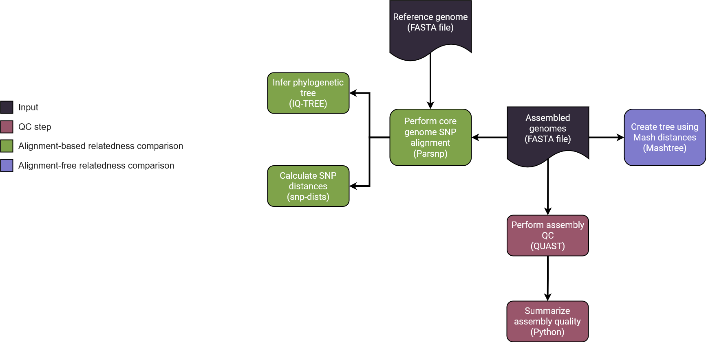

## Dryad


**Dryad** is a [Nextflow](https://www.nextflow.io/) pipeline to construct reference free core-genome historical or SNP phylogenetic trees for examining prokaryote relatedness in outbreaks. Dryad performs both a reference free core-genome analysis based off of the approach outlined by Oakeson et. al and/or a SNP analysis using Parsnp and Mashtree.

Dryad analyzes fasta files that have been processed either by [Spriggan](https://github.com/wslh-bio/spriggan) or by [Phoenix](https://github.com/CDCgov/phoenix). Dryad is split into two major workflows:
1. A workflow dedicated to fine scale outbreak investigations that are within a singular outbreak.
2. A workflow dedicated to identifying historical relatedness across multiple years and multiple outbreaks.  

## Table of Contents:
[Usage](#usage)
[Input](#input)
[Parameters](#parameters)
[Workflow](#workflow)
[Output](#output)
[Credits](#credits)
[Contributions-and-Support](#contributions-and-support)
[Citations](#citations)

## Usage

> [!NOTE]
> If you are new to Nextflow and nf-core, please refer to [this page](https://nf-co.re/docs/usage/installation) on how to set-up Nextflow. Make sure to [test your setup](https://nf-co.re/docs/usage/introduction#how-to-run-a-pipeline) with `-profile test` before running the workflow on actual data.

To run an alignment free comparison, use:

```bash
nextflow run wslh-bio/dryad \
   -profile <docker/singularity/.../institute> \
   --input samplesheet.csv \
   --outdir <OUTDIR> \
   --alignment_free
```
By default, Dryad runs an alignment free comparison if nothing is specified. 

If you would like to run an alignment based comparison, use:

```bash
nextflow run wslh-bio/dryad \
   -profile <docker/singularity/.../institute> \
   --input samplesheet.csv \
   --outdir <OUTDIR> \
   --fasta <REFERENCE_FASTA> \
   --alignment_based 
```

## Input

Prepare a samplesheet with your input data with each row representing one fasta file. The samplesheet will look as follows:

`samplesheet.csv`:

| sample | fasta |
| ------------- | ------------- | 
| sample_1 | 2024_1.contigs.fa |
| sample_2 | 2024_2.contigs.ga |

## Parameters

Dryad's main parameters and their defaults are shown in the table below:

| Parameter | Parameter description and defaults | Example useage |
| ------------- | ------------- | ------------- |
| input | Path to comma-separated file containing information about the samples in the experiment | --input <PATH_TO_SAMPLESHEET> |
| outdir | Output directory where the results will be saved. Abolsute path must be used for storage on cloud infrastructure | --outdir <DESIRED_OUTPUT_PATH> |
| profile | Denotes how to access containerized software | -profile aws |
| fasta | Reference fasta used for alignment based comparisons | --fasta <PATH_TO_REF_FASTA> |
| alignment_based | Performs a fine scale analysis within a singular outbreak | --alignment_based |
| alignment_free | Performs a historical analysis across multiple years and outbreaks | --alignment_free |
| task.cpus | Denotes how many cpus to use for Mashtree. Default task.cpus is 2. |--task.cpus 4 |
| cg_tree_model | Tells IQ-TREE what to [model](http://www.iqtree.org/doc/Substitution-Models) to use. Default cg_tree_model is GTR+G | --cg_tree_model GTR+G |
| phoenix | If the data was run run through pheonix, skips Quast and it's summary options. | --phoenix |

## Workflow



### 1. Universal Steps
   - Enter assembled FASTA genomes into a samplesheet. 
   - [Quast v5.2.0](http://bioinf.spbau.ru/quast) is used to determine assembly quality if Phoenix is not indicated.
   - Quast results are summarized with a custom python script to increase readability.
### 2. Alignment
   - Historical Comparison
      - [Mashtree v1.4.6](https://github.com/lskatz/mashtree) generates a phylogenetic tree using Mash distances. 
   - Fine scale Comparison
      - Requires at least 3 genomes
      - [Parsnp v2.0.5](https://github.com/marbl/parsnp) is used to perform a core genome alignment.
      - [IQ-TREE v2.3.0](https://github.com/Cibiv/IQ-TREE) is used for inferring a phylogenetic tree.
      - [Snp-dists v0.8.2](https://github.com/tseemann/snp-dists) is used to calculate the SNP distance matrix.

## Output
An example of Dryad's output directory structure for both alignment based and alignment free output files can be seen below. These directories will not include quast if the parameter pheonix is utilized:
```
alignment_based_output/
├── iqtree
│   └── parsnp.snps.mblocks.treefile
├── parsnp
│   └── parsnp_output
│       ├── parsnp.ggr
│       ├── parsnp.snps.mblocks
│       ├── parsnp.tree
│       └── parsnp.xmfa
├── pipeline_info
│   ├── *.html
│   ├── *.txt
│   └── samplesheet.valid.csv
├── quast
│   ├── *.quast.report.tsv
│   ├── *.transposed.quast.report.tsv
│   └── quast_results.tsv
└── snpdists
    └── snp_dists_matrix.tsv
```

```
alignment_free_output/
├── mashtree
│   └── mashtree.bootstrap.dnd
├── pipeline_info
│   ├── *.html
│   ├── *.txt
│   └── samplesheet.valid.csv
└── quast
    ├── *.quast.report.tsv
    ├── *.transposed.quast.report.tsv
    └── quast_results.tsv
```
Notable output files:

**Alignment based**  
| File | Output |
| ------------- | ------------- |
| quast_results.tsv | Assembly quality results |
| snp_dists_matrix.tsv | Number of SNP distances between each pair of isolates |
| parsnp.snps.mblocks.treefile | Maximum likelihood phylogenetic tree|


**Alignment free**
| File | Output |
| ------------- | ------------- |
| quast_results.tsv | Assembly quality results |
| mashtree.bootstrap.dnd | Neignbor joining tree based on mash distances |


> [!WARNING]
> Please provide pipeline parameters via the CLI or Nextflow `-params-file` option. Custom config files including those provided by the `-c` Nextflow option can be used to provide any configuration _**except for parameters**_;
> see [docs](https://nf-co.re/usage/configuration#custom-configuration-files).

## Credits

Dryad was written by Dr. [Kelsey Florek](https://github.com/k-florek), Dr. [Abigail Shockey](https://github.com/AbigailShockey), and [Eva Gunawan](https://github.com/evagunawan).

We thank the bioinformatics group at the Wisconsin State Laboratory of Hygiene for all of their contributions. 

## Contributions and Support

If you would like to contribute to this pipeline, please see the [contributing guidelines](.github/CONTRIBUTING.md).

## Citations

If you use Dryad for your analysis, please cite it using the following:

K. Florek, AC. Shockey, & E. Gunawan (2014). Dryad (Version 4.0.0) [https://github.com/wslh-bio/dryad].

An extensive list of references for the tools used by the pipeline can be found in the [`CITATIONS.md`](CITATIONS.md) file.

This pipeline uses code and infrastructure developed and maintained by the [nf-core](https://nf-co.re) community, reused here under the [MIT license](https://github.com/nf-core/tools/blob/master/LICENSE).

> **The nf-core framework for community-curated bioinformatics pipelines.**
>
> Philip Ewels, Alexander Peltzer, Sven Fillinger, Harshil Patel, Johannes Alneberg, Andreas Wilm, Maxime Ulysse Garcia, Paolo Di Tommaso & Sven Nahnsen.
>
> _Nat Biotechnol._ 2020 Feb 13. doi: [10.1038/s41587-020-0439-x](https://dx.doi.org/10.1038/s41587-020-0439-x).
