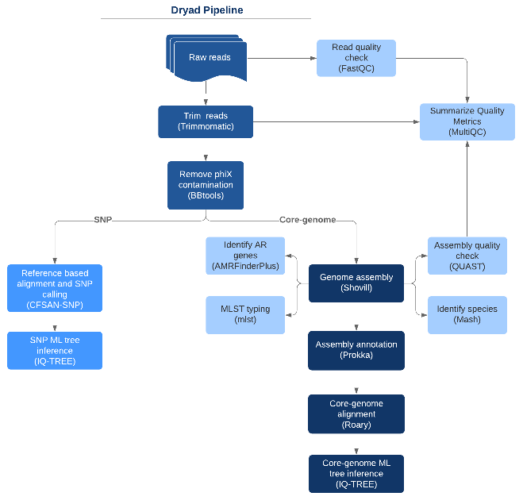

Latest Release: 
[](https://travis-ci.org/k-florek/dryad)

Dryad is a pipeline to construct reference free core-genome or SNP phylogenetic trees for examining prokaryote relatedness in outbreaks. Dryad accomplishes this using [NextFlow](https://www.nextflow.io/) allowing the pipeline to be run in numerous environments using [docker](https://www.docker.com/) or [singularity](https://sylabs.io/) either locally or in an HPC or cloud environment. Dryad will perform both a reference free core-genome analysis based off of the approach outlined by [Oakeson et. al](https://www.ncbi.nlm.nih.gov/pubmed/30158193) and/or a SNP analysis using the [CFSAN-SNP](https://snp-pipeline.readthedocs.io/en/latest/readme.html) pipeline.

### Table of Contents:
[Installation](#installing-dryad)  
[Usage](#using-the-pipeline)  
[Workflow outline](#workflow-outline)
[Core-genome](#core-Genome-phylogenetic-tree-construction)  
[SNP](#snp-phylogenetic-tree-construction)  
[Quality assessment](#quality-assessment)  
[Genome cluster report](#genome-cluster-report)  
[Output](#output-files)  
[Dependencies](#dependencies)  

#### Installing Dryad
Dryad uses a combination of nextflow and containers to function and is dependent on either [Docker](https://docs.docker.com/get-docker/) or [Singularity](https://sylabs.io/guides/3.5/user-guide/quick_start.html#quick-installation-steps).

Installing dryad can be done with pip using `pip install dryad`. If you are running Dryad from the git repository, a python dependency needs to be installed via pip using `pip install -r requirements.txt`.

#### Using the pipeline
The pipeline is designed to start from raw Illumina short reads. All reads must be in the same directory. Then start the pipeline using `dryad` and follow the options for selecting and running the appropriate pipeline.
```
usage: dryad [-h] [--output <output_path>] [--core-genome] [--snp] [-r <path>]
             [-ar] [--sep sep_chars] [--profile {docker,singularity}]
             [--config CONFIG] [--get_config] [--resume] [--report]
             [reads_path]

A comprehensive tree building program.

positional arguments:
  reads_path            path to the directory of raw reads in the fastq format

optional arguments:
  -h, --help            show this help message and exit
  --output <output_path>, -o <output_path>
                        path to ouput directory, default "dryad_results"
  --core-genome, -cg    construct a core-genome tree
  --snp, -s             construct a SNP tree, requires a reference sequence in
                        fasta format (-r)
  -r <path>             reference sequence for SNP pipeline
  -ar                   detect AR mechanisms
  --sep sep_chars       dryad identifies sample names from the name of the
                        read file by splitting the name on the specified
                        separating characters, default "_"
  --profile {docker,singularity}
                        specify nextflow profile, dryad will try to use docker
                        first, then singularity
  --config CONFIG, -c CONFIG
                        Nextflow custom configureation
  --get_config          get a Nextflow configuration template for dryad
  --resume              resume a previous run
  --report <path>       RMarkdown file for report.
```

Both pipelines begin with a quality trimming step to trim the reads of low quality bases at the end of the read using [Trimmomatic v0.39](http://www.usadellab.org/cms/?page=trimmomatic), the removal of PhiX contamination using [BBtools v38.76](https://jgi.doe.gov/data-and-tools/bbtools/), and the assessment of read quality using [FastQC v0.11.8](https://www.bioinformatics.babraham.ac.uk/projects/fastqc/). After processing, the reads are used by each pipeline as needed.  
*Note: Both pipelines can be run automatically in succession using the -cg and -s parameters simultaneously.*

###### Additional workflow parameters
In order to tweak the versions of software used or specific workflow parameters. You can obtain the configuration file using `--get_config`. Then use the custom configuration with the `--profile` flag when running dryad.

#### Workflow outline



#### Core Genome phylogenetic tree construction
The core genome pipeline takes the trimmed and cleaned reads and infers a phylogenetic tree that can be used for inferring outbreak relatedness. This pipeline is based loosely off of the pipeline described here by [Oakeson et. al](https://www.ncbi.nlm.nih.gov/pubmed/30158193).

Species and MLST type are predicted from the assemblies generated during the core genome pipeline, and assembly quality is evaluated.

Additionally, the core genome pipeline can be run with `-ar` to predict antibiotic resistance genes.

The core genome pipeline uses the following applications and pipelines:

[Shovill v1.0.4](https://github.com/tseemann/shovill)
Shovill is a pipeline centered around SPAdes but alters some of the steps to get similar results in less time.

[Prokka v1.14.5](https://github.com/tseemann/prokka)
Prokka is a whole genome annotation tool that is used to annotate the coding regions of the assembly.

[Roary v3.12.0](https://github.com/sanger-pathogens/Roary)
Roary takes the annotated genomes and constructs a core gene alignment.

[IQ-Tree v1.6.7](http://www.iqtree.org/)
IQ-Tree uses the core gene alignment and creates a maximum likelihood phylogenetic tree bootstraped 1000 times.

[Mash v2.1](https://github.com/marbl/Mash)
Mash performs fast genome and metagenome distance estimation using MinHash.

[MLST v2.17.6](https://github.com/tseemann/mlst)
MLST scans contig files against PubMLST typing schemes.

[QUAST v5.0.2](http://bioinf.spbau.ru/quast)
QUAST evaluates genome assemblies.

[AMRFinderPlus v3.1.1](https://github.com/ncbi/amr)
AMRFinderPlus identifies acquired antimicrobial resistance genes.

#### SNP phylogenetic tree construction
The SNP pipeline takes the trimmed and cleaned reads and infers a phylogenetic tree that can be used for inferring outbreak relatedness. The pipeline requires the path to the raw reads (mentioned above) and a reference genome in fasta file format.

The SNP pipeline uses the following applications and pipelines:

[CFSAN SNP Pipeline v2.0.2](https://github.com/CFSAN-Biostatistics/snp-pipeline)

[IQ-Tree v1.6.7](http://www.iqtree.org/)
IQ-Tree uses an alignment of the SNP sites to create a maximum likelihood phylogenetic tree bootstrapped 1000 times.

#### Quality Assessment
The results of quality checks from each pipeline are summarized using [MultiQC v1.8](https://multiqc.info/)

#### Genome cluster report
Dryad can generate an easily attributable analysis report. This uses RMarkdown and the results from the SNP and core genome pipelines to generate the genome cluster report. This option can be run using `--report`. The plotting defaults of the RMarkdown file (/report/report.Rmd) can be modified as necessary and rebuilt using `dryad_report`.

#### Output files

```
dryad_results
├── logs
│   ├── cleanedreads
│   ├── dryad_execution_report.html
│   ├── dryad_trace.txt
│   ├── fastqc
│   ├── quast
│   └── work
└── results
    ├── amrfinder
    ├── annotated
    ├── ar_predictions_binary.tsv
    ├── ar_predictions.tsv
    ├── assembled
    ├── cluster_report.pdf
    ├── core_gene_alignment.aln
    ├── core_genome_statistics.txt
    ├── core_genome.tree
    ├── mash
    ├── mlst.tsv
    ├── multiqc_data
    ├── multiqc_report.html
    ├── report_template.Rmd
    ├── snp_distance_matrix.tsv
    ├── snpma.fasta
    └── snp.tree
```
**ar_predictions_binary.tsv** - Presence/absence matrix of antibiotic resistance genes.  
**ar_predictions.tsv** - Antibiotic tesistance genes detected.  
**cluster_report.pdf** - Genome cluster report.  
**core_gene_alignment.aln** - Alignment of the core set of genes.  
**core_gene_statistics.txt** - Information about the number of core genes.  
**core_genome_tree.tree** - The core-genome phylogenetic tree created by the core-genome pipeline.  
**mash/{sample}.mash.txt** - Species prediction for each sample.  
**mlst.tsv** - MLST scheme predictions.  
**multiqc_report.html** - QC report.  
**report_template.Rmd** - R Markdown template for generating the cluster_report.pdf
**snp_distance_matrix.tsv** - The SNP distances generated by the SNP pipeline.
**snp.tree** - The SNP tree created by the SNP pipeline.  
**snpma.fasta** - The SNP alignment.  

#### Authors
[Kelsey Florek](https://github.com/k-florek), WSLH Bioinformatics Scientist  
[Abigail Shockey](https://github.com/AbigailShockey), WSLH Bioinformatics Fellow
